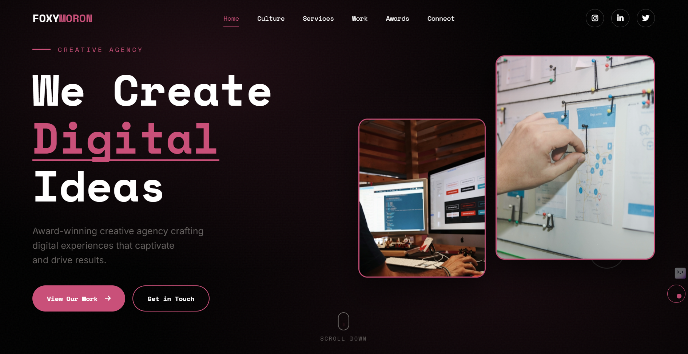
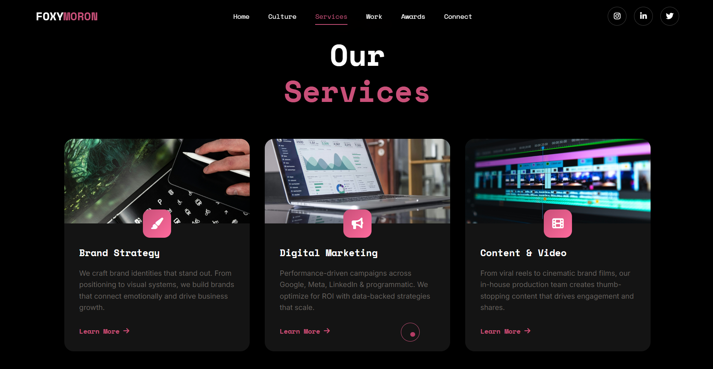
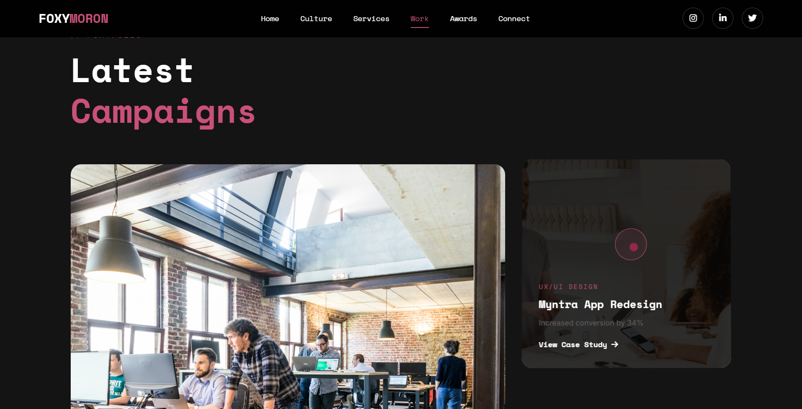
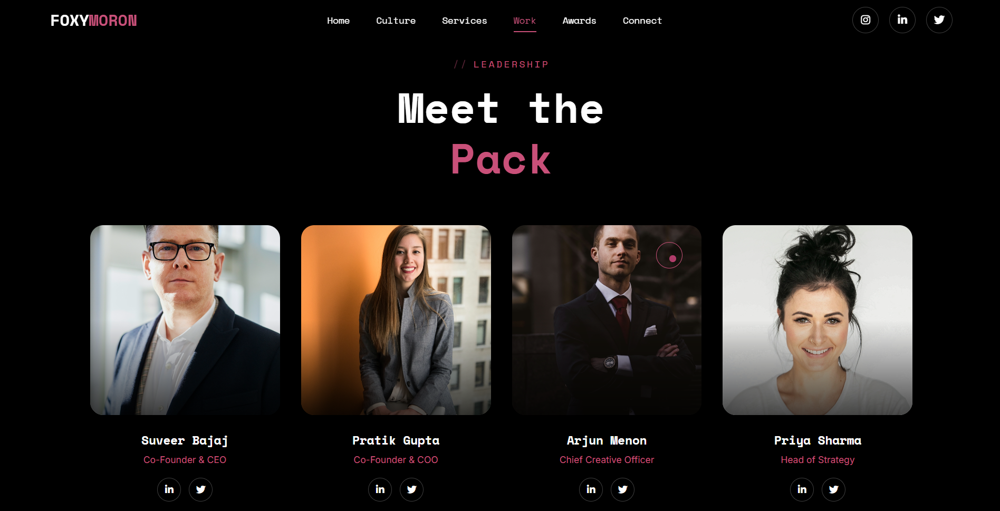
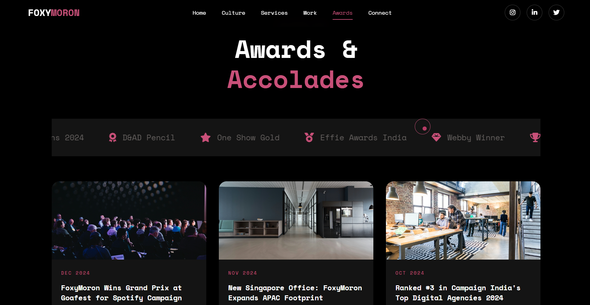
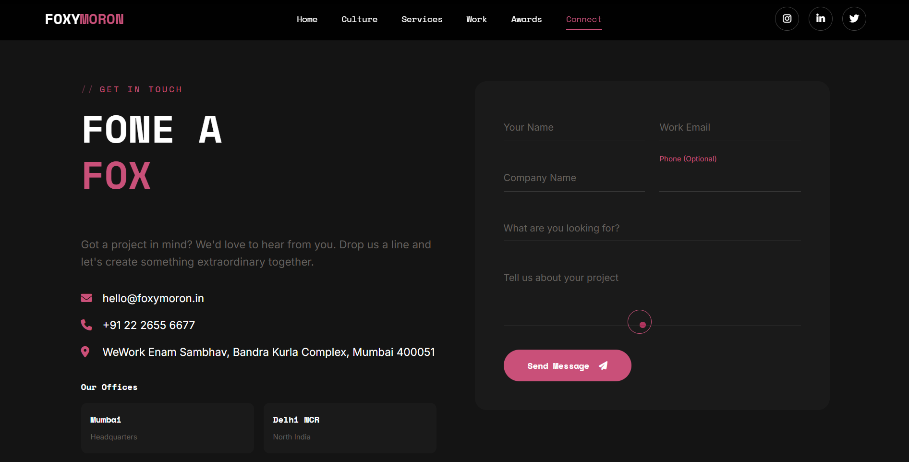

# FoxyMoron - Modern Creative Agency Template

Tired of dull, outdated website templates? This is a modern, fully responsive HTML template designed for creative agencies, startups, and businesses. A sleek, professional design that can transform your website and save hours of development time.

Built with HTML, CSS, and JavaScript featuring smooth animations, custom cursor effects, and a sleek dark theme design.

## Preview

<a href="https://youtu.be/ii9vyzIvvwk">
  
  <p align="center">▶️ <strong>Click to Watch Full Demo on YouTube</strong></p>
</a>

### Screenshots

#### Preloader


#### Hero Section


#### Services Section


#### Work Portfolio


#### Team Section


#### Awards Section


#### Contact Form


## Features

- ✅ **Fully Responsive & Mobile-Friendly** - Optimized for all device sizes with touch-friendly targets
- ✅ **Clean, Modern Layout** - Perfect for agencies & portfolios
- ✅ **Easy to Customize** - Adapt it for your brand in minutes
- ✅ **Professional Look** - No messy code, just clean architecture
- **Animated Preloader** - Stylish loading screen with progress bar
- **Custom Cursor** - Interactive cursor with follower effect
- **Hero Section** - Eye-catching hero with animated text and floating shapes
- **Smooth Scroll Animations** - Elements animate into view on scroll
- **Parallax Effects** - Background shapes with parallax movement
- **Services Grid** - Showcase of agency services with hover effects
- **Portfolio Gallery** - Project showcase with overlay details
- **Team Section** - Leadership team profiles with social links
- **Awards Marquee** - Auto-scrolling awards ticker
- **Contact Form** - Elegant form with floating labels
- **Dark Theme** - Modern dark color scheme with pink accents
- **Accessibility** - Keyboard navigation, ARIA labels, and screen reader support
- **Performance** - Lazy loading images and optimized scroll events
- **SEO Optimized** - Meta tags and semantic HTML structure

💡 **Perfect for designers and developers who want to ditch ugly templates and create websites that actually impress clients.**

## Tech Stack

- HTML5
- CSS3 (Custom properties, Flexbox, Grid, Animations)
- Vanilla JavaScript
- Google Fonts (Space Mono, Inter)
- Font Awesome Icons

## Sections

1. **Preloader** - Animated loading screen
2. **Navigation** - Fixed header with mobile menu toggle
3. **Hero** - Main banner with CTA buttons
4. **About** - Company story with statistics
5. **Clients** - Trusted brands logos
6. **Services** - Six service offerings
7. **Work/Portfolio** - Featured campaign case studies
8. **Team** - Leadership profiles
9. **Awards** - Recognition and news
10. **Contact** - Contact form and office locations
11. **Footer** - Links and social media

## Getting Started

1. Clone or download this repository
2. Open `index.html` in your browser
3. No build process required - just static files

## Development

- Edit `index.html` for structure changes
- Modify `styles.css` for styling updates
- Update `script.js` for animation and interaction changes

## File Structure

```
animated_home/
├── index.html      # Main HTML file
├── styles.css      # Stylesheet
├── script.js       # JavaScript animations
├── assets/
│   ├── images/     # Screenshots
│   └── preview.mp4 # Video preview
└── README.md       # This file
```

## Color Palette

| Color | Hex | Usage |
|-------|-----|-------|
| Background | `#0a0a0a` | Main background |
| Primary Pink | `#e91e63` | Accent color, highlights |
| Text Light | `#ffffff` | Primary text |
| Text Muted | `#888888` | Secondary text |

## Browser Support

- Chrome (latest)
- Firefox (latest)
- Safari (latest)
- Edge (latest)

## Recent Updates

- Added comprehensive accessibility features (ARIA labels, keyboard navigation, skip links)
- Implemented performance optimizations (lazy loading, scroll throttling)
- Enhanced responsive design with improved touch targets
- Added SEO meta tags and social media meta properties
- Improved focus states and keyboard navigation support

## Contributing

We welcome contributions to improve this project! Please feel free to submit issues and pull requests.

## License

This project is for demonstration purposes.

---

Built with creativity and code.
